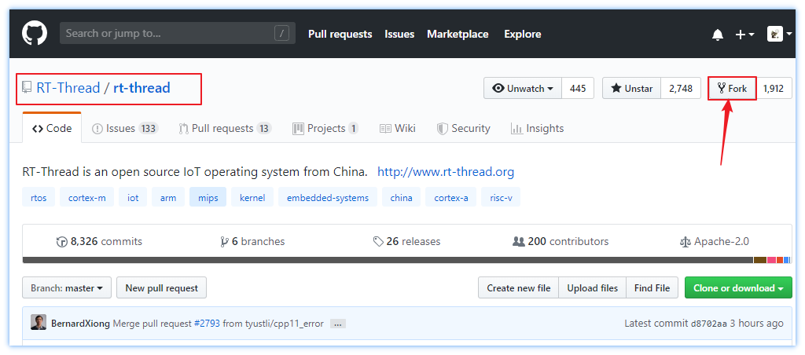
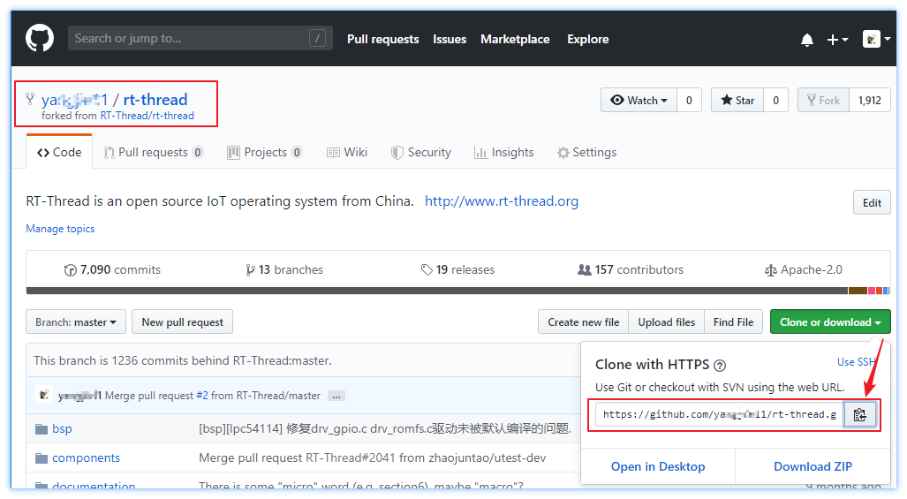
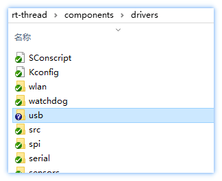
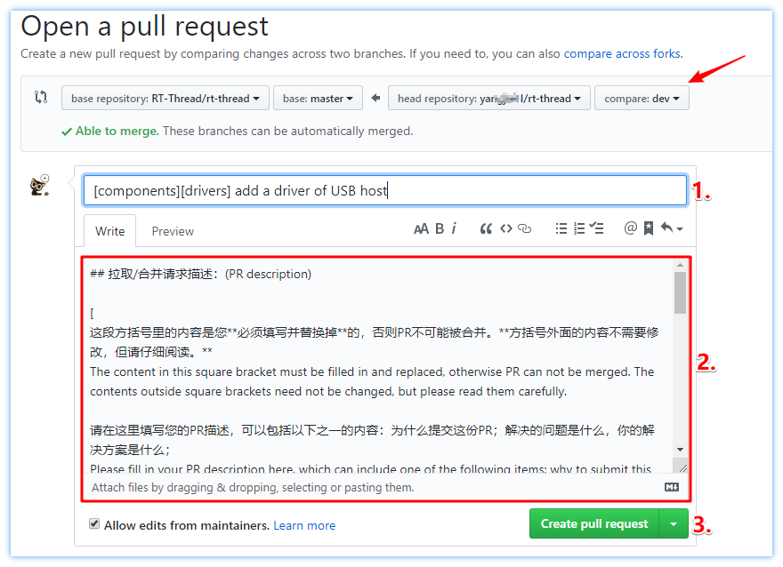
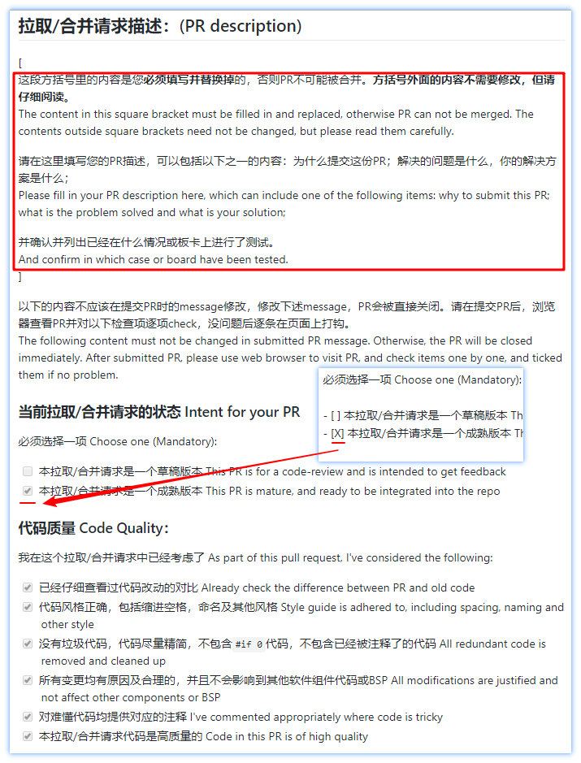
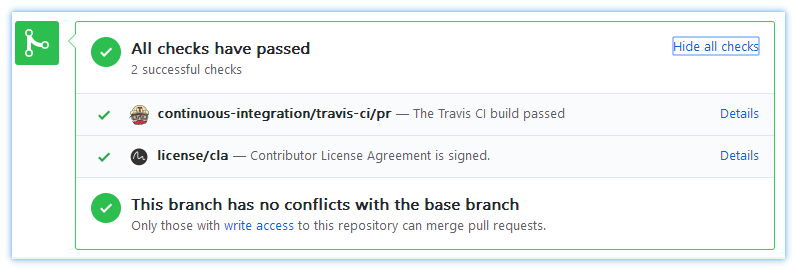

# Contribution Guide

We sincerely thank you for your contribution, and welcome to submit the code through GitHub's fork and Pull Request processes.

First, explain the word Pull Request. Pull request means to send a request. The purpose of the developer initiating Pull Request is to request the repository maintainer to adopt the code submitted by the developer.

When you want to correct mistakes in other people's repositories, follow the following procedure:

- To fork someone else's repository is equivalent to copying someone else's information. Because you can't guarantee that your modification is correct and beneficial to the project, you can't modify it directly in someone else's repository, but first fork it into your own git repository.
- Clone code to your own PC local, create a new branch, modify bugs or add new features, and then launch pull request to the original repository, so that the original repository manager can see the changes you submitted.
- The original repository manager reviews this submission and, if correct, merge it into his own project. Merge means merging, merging the part of code you modified into the original repository to add code or replace the original code. So far, the whole Pull Request process is over.

## Coding Style

Refer to the `coding_style_en.txt` file in the rt_thread project documentation directory for the RT-Thread code programming style.

## Preparation

Install Git: You need to add Git's directory to the system environment variable.

## Contribution Process

Now take RT-Thread repository as an example to illustrate the process of contributing code:

### Fork

Fork the RT-Thread/rt-thread repository into your git repository.



### Clone

In your repository, copy the repository links after your fork: 



You can use the `git clone` command to copy the repository to your PC:

```
git clone [url]
```


### Create a New Branch

It is recommended that you create your own development branch based on the master branch, and use following  commands to create a new branch:

```
git checkout -b YourBranchName
```

For example, create a branch named "dev": `git checkout-b dev`.

### Developing 

Modify bugs and submit new functional code. For example, suppose the developer adds a USB driver:



### Temporarily Store Modified Files

Add all changes to the temporary area:

```
git add .
```

If you only want to add some specified files to the temporary area, use other commands of `git add`.

### Commit

Submit this modification to the local repository:

```
git commit -m "Describe your submission here"
```

> Note: If there are multiple commits in the local development branch, in order to ensure that the RT-Thread repository commit is clean, please tidy up the local commits. More than five commits are not accepted by Pull Request.。

### Push to Your Remote Repository

Push the modified content to the branch of your remote repository. It is recommended that the branch name of the remote repository be consistent with the local branch name.Use the following command to push: 

```
git push origin YourBranchName
```

### Create a Pull Request

Enter the RT-Thread repository under your Github account and click `New pull request -> Create pull request`. Make sure you choose the right branch.



Step 1: Fill in the title of this Pull Request

Step 2: Modify the description information of this Pull Request (modify it in `Write` and preview it with `Preview`):

- Modify PR Description: Replace the content in the red box below with the description of this pull request according to the requirements in the red box below.

- Check PR Options: Fill in [x] in the OK Options check box to confirm. Note that there are no spaces on both sides of [x].



Step 3：Create pull request.

### Sign CLA

The first contribution to RT-Thread requires signing the *Contributor License Agreement*.


Make sure that CLA shows successful signing and CI compilation, as shown in the following figure:



Note: Do not submit commmit using a non-GitHub account, or commit using a different account, which can lead to CLA signing failure.

### Review Pull Request

Once the request is successful, the RT-Thread maintainer can see the code you submitted. The code will be reviewed and comments will be filled in on GitHub. Please check the PR status in time and update the code according to the comments.

### Merge Pull Request

If the Pull Request code is okay, the code will be merged into the RT-Thread repository. This time Pull Request succeeded.

So far, we have completed a code contribution process.

## Keep in Sync with RT-Thread Repository

The content of the RT-Thread GitHub repository is always updated. To develop based on the latest RT-Thread code, you need to update the local repository.

After clone, the local master branch content is consistent with the master branch content of the RT-Thread repository. But when the RT-Thread repository is updated, your local code is different from the RT-Thread code.

The local master is synchronized with the RT-Thread repository of your own GitHub account. If there is no content modification for the master branch (please create a new branch for development), then you can keep the local code synchronized with the RT-Thread repository according to the following steps:

- To view the existing remote repository, there is usually only one default origin, which is your own remote repository:

```c
$ git remote -v
origin  https://github.com/YOUR_USERNAME/YOUR_FORK.git (fetch)
origin  https://github.com/YOUR_USERNAME/YOUR_FORK.git (push)
```

* Add the RT-Thread remote repository and name it `rtt`,  or you can customize the name by yourself:

```c
$ git remote add rtt https://github.com/RT-Thread/rt-thread.git
```

* View all remote repositories tracked locally:

```c
$ git remote -v
origin    https://github.com/YOUR_USERNAME/YOUR_FORK.git (fetch)
origin    https://github.com/YOUR_USERNAME/YOUR_FORK.git (push)
rtt       https://github.com/RT-Thread/rt-thread.git (fetch)
rtt       https://github.com/RT-Thread/rt-thread.git (push)
```

* Pull the code from the master branch of RT-Thread remote repository and merge it into the local master branch:

```c
git pull rtt master
```

## Reference

* Refer to the [*GitHub - Contributing to a Project*](https://git-scm.com/book/en/v2/GitHub-Contributing-to-a-Project)  section of the official Git document for details.

  
